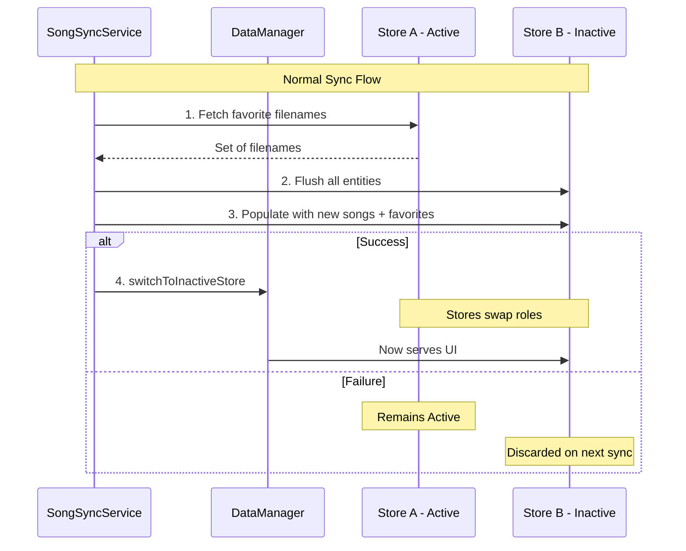

# A/B Database Swap Pattern

Safe atomic database updates using two CoreData stores. The active store serves the UI while the inactive store is rebuilt with new data.

## How It Works

1. **Favorites Preservation**: Before rebuilding, we extract favorite filenames from the active store
2. **Flush Inactive**: Clear all data from the inactive store
3. **Populate**: Insert new songs from CSV, reapplying favorites by filename match
4. **Atomic Swap**: On success, flip `currentDB` in UserDefaults and reload container
5. **Automatic Rollback**: On failure, the active store remains untouched

## Crash Recovery

- A `buildInProgress` flag is set before building starts
- If the app restarts with this flag set, we flush the inactive store
- Ensures no partial data ever reaches production

## UserDefaults Keys

| Key | Purpose |
|-----|---------|
| `currentDB` | "A" or "B" - which store is active |
| `buildInProgress` | Crash recovery flag |
| `storedCSVVersion` | Version of current database |

