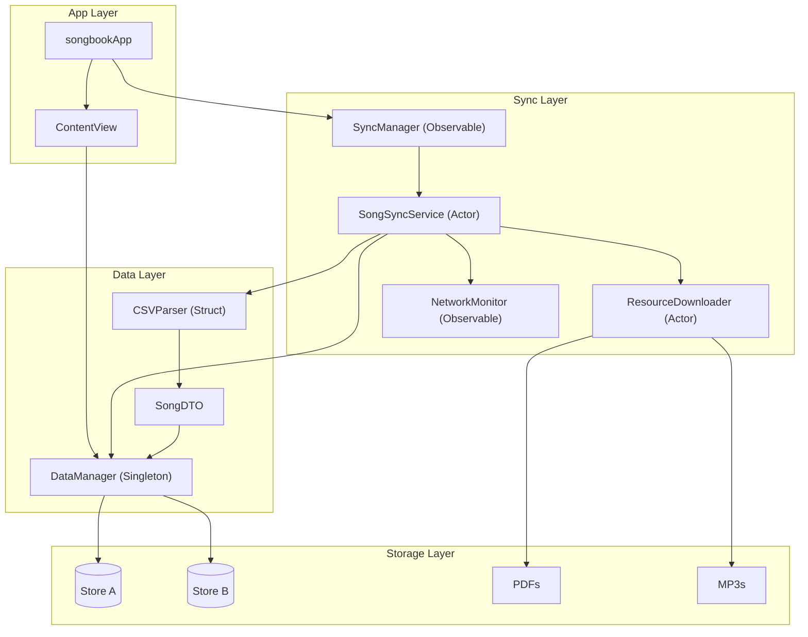

# Architecture Overview

High-level data flow of the Songbook app's data management system.

## Components

| Component | Type | Responsibility |
|-----------|------|----------------|
| `SyncManager` | Observable | UI-facing wrapper, triggers sync, forwards state |
| `SongSyncService` | Actor | Orchestrates sync flow, version checks, A/B swap |
| `ResourceDownloader` | Actor | Queues and downloads PDF/MP3 files with retry |
| `NetworkMonitor` | Observable | Tracks connectivity and metered status |
| `CSVParser` | Struct | Parses CSV into SongDTO array |
| `DataManager` | Singleton | Manages CoreData stores, A/B pattern |

