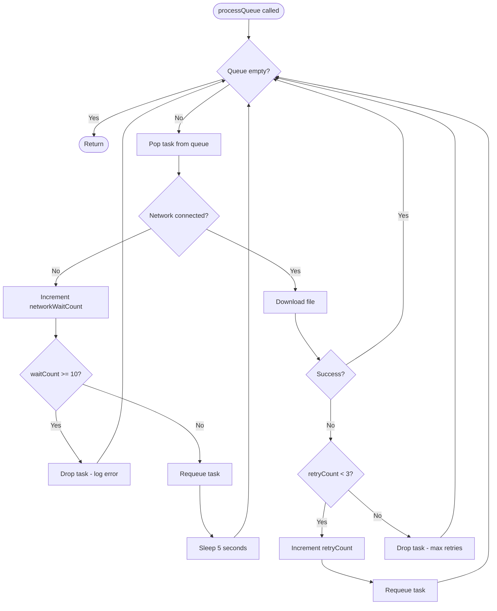

# Download Queue Flow

The `ResourceDownloader` actor manages a queue of PDF and MP3 downloads with retry logic and network awareness.



## DownloadTask Structure

```swift
struct DownloadTask: Sendable {
    let filename: String
    let type: ResourceType      // .pdf or .mp3
    var retryCount: Int = 0     // max 3 retries per download attempt
    var networkWaitCount: Int = 0  // max 10 waits (~50 seconds)
}
```

## Safeguards

| Safeguard | Value | Purpose |
|-----------|-------|---------|
| `maxRetries` | 3 | Failed downloads retry up to 3 times |
| `maxNetworkWaits` | 10 | Give up after ~50s of no network |
| Deduplication | — | Same file won't be queued twice |
| File exists check | — | Skip download if file already exists |

## Metered Connection Handling

Currently only logs when on cellular/metered connection.

