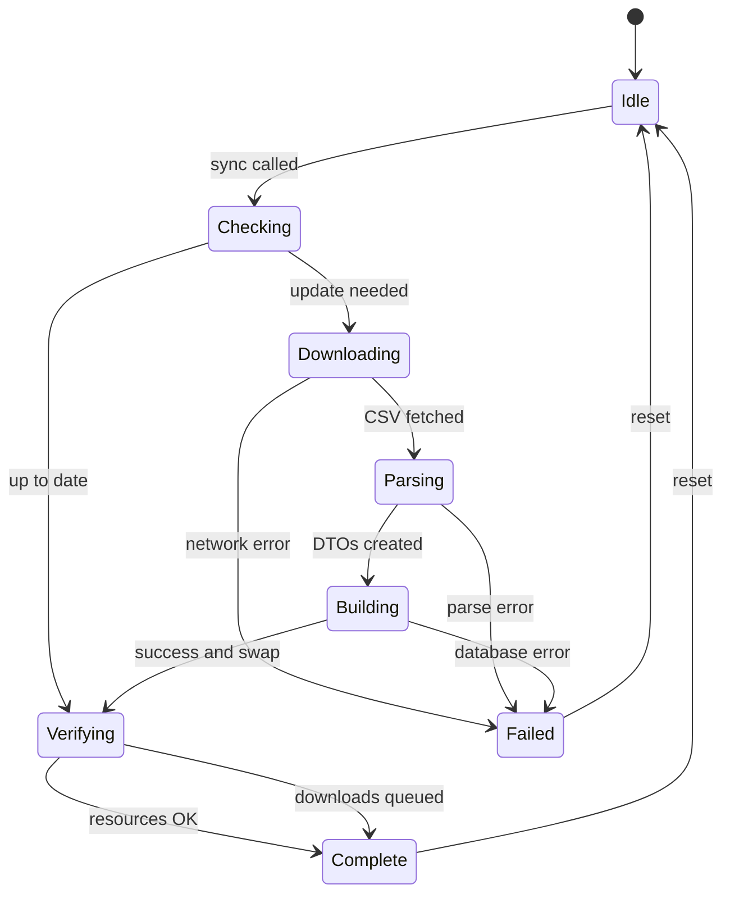

# Sync State Machine

The sync process moves through distinct states, observable by the UI for progress indication.



## States

| State | Description |
|-------|-------------|
| `idle` | Not syncing |
| `checking` | Comparing versions, recovering crashed builds |
| `downloading` | Fetching CSV from network or bundle |
| `parsing` | Converting CSV to SongDTO array |
| `building` | Populating inactive CoreData store |
| `verifying` | Checking for missing PDF/MP3 resources |
| `complete` | Sync finished successfully |
| `failed(String)` | Sync failed with error message |

## Version Comparison

```
storedVersion < max(bundledVersion, onlineVersion)  →  Update needed
databaseIsEmpty                                      →  Force sync
```

## State Observation

States are pushed via `AsyncStream<SyncState>`:

```swift
// in SyncManager
for await serviceState in await syncService.stateStream {
    self.state = serviceState
}
```

